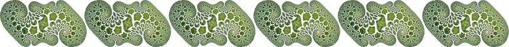

## Visualisation
- [Mars Oceans Visualisation](https://bridges.monash.edu/articles/media/Mars_Oceans_Visualisation/12792575) playing around with open data, GLSL shader flooding the Martian planet surface with topography created from public domain data obtained from the USGS Astrogeology Science Center.
- [Cyclone Debbie wind tracers over Great Barrier Reef, data from eReefs](https://bridges.monash.edu/articles/media/Cyclone_Debbie_wind_tracers_over_Great_Barrier_Reef_data_from_eReefs/12725381) open data read from NCI thredds catalogue.
- [Virtual reality and drones could unlock secrets about the mysterious Plain of Jars in Laos](http://www.abc.net.au/news/2016-10-18/vr-and-drones-could-unlock-secrets-about-the-plain-of-jars-laos/7938520)
- [LAWLESS – The Real Bushrangers](https://genepoolproductions.com/lawless-project) - Worked on vis for 2 episodes, Photo: filming visualisation in the CAVE2 [here](https://images.squarespace-cdn.com/content/v1/5bcff59ca09a7e44dee61ca1/1542687206271-OH6Z41Q3BP14B4JTOZNC/36_Lawless_Kelly_Cave_05_edit.jpg?format=2500w)
- [LavaVu WebGL demo page](https://lavavu.github.io/)
- [LavaVu readme](https://github.com/OKaluza/LavaVu/blob/master/README.md)
- Some old LavaVu/gLucifer in action: [video](https://www.youtube.com/watch?v=cVulRP2tUGM)
- [ShareVol demo page](http://owen.kaluza.id.au/sharevol/)
- [The original kookaburra WebGL model](http://cave2.github.io/websurfer/?model=examples/quayle_kookaburra)
- [Geothermal model visualisations](https://figshare.com/articles/poster/Underworld_and_multi_basin_heat_flow/763080)
- [Latrobe Valley - some earliest 3d model work](https://bridges.monash.edu/articles/figure/Latrobe_Valley_images_from_the_Auscope_Geothermal_demonstrators/15001218)

## Publications
- [Mantle plume dynamics at the rear of a retreating slab](https://academic.oup.com/gji/article-abstract/222/2/1146/5835229)
- [UWGeodynamics: A teaching and research tool for numerical geodynamic modelling](http://joss.theoj.org/papers/10.21105/joss.01136)
- [Benchmark of three-dimensional numerical models of subduction against a laboratory experiment](https://www.sciencedirect.com/science/article/pii/S0031920118300360)
- [Line of fire - what happened at the Wantabadgery seige?](https://www.ncbi.nlm.nih.gov/pubmed/29058106)
- [Large-scale comparative visualisation of sets of multidimensional data](https://peerj.com/articles/cs-88/)
- [Stereoscopic space map – semi-immersive configuration of 3D-stereoscopic tours in multi-display environments](https://research.monash.edu/en/publications/stereoscopic-space-map-semi-immersive-configuration-of-3d-stereos)
- [An interactive three dimensional approach to anatomical description—the jaw musculature of the Australian laughing kookaburra (_Dacelo novaeguineae_)](https://peerj.com/articles/355/)
- [The multi-modal Australian ScienceS Imaging and Visualization Environment (MASSIVE) high performance computing infrastructure: applications in neuroscience and neuroinformatics research](https://www.ncbi.nlm.nih.gov/pubmed/24734019)
- [Fast Diffusion-Guided QSM Using Graphical Processing Units ](http://archive.ismrm.org/2013/2667.html)

## Software
- LavaVu http://github.com/lavavu/lavavu
- Underworld https://github.com/underworldcode/underworld2
- ShareVol http://github.com/okaluza/sharevol
- Fractured http://github.com/okaluza/fractured

## Art
- [2016 Digital Exhibition](http://owen.kaluza.id.au/2016)
- [Old work on Redbubble from 2007](http://redbubble.com/people/owenk) 
- More coming soon!
- Fractured http://fract.ured.me

Mathjax test
$$
K(a,b) = \int \mathcal{D}x(t) \exp(2\pi i S[x]/\hbar)
$$

---

